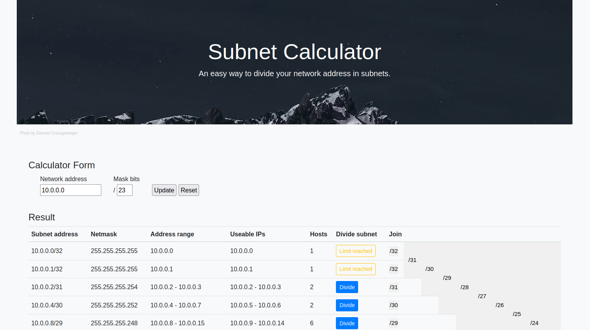

# Subnet Calculator
After using for long time the "sipcalc tool" from CLI, it's now time to have something more visual and capable of dividing as well as joining subnets.

### Usage
Download the repo and open the sc.html file to use the calculator.
1. Enter the IP address and subnet you want to divide.
2. Divide or join subnets.

Happy networking!
